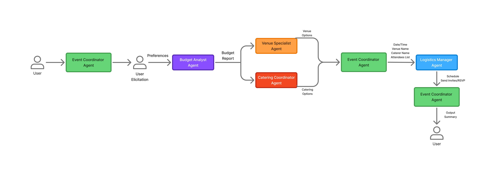
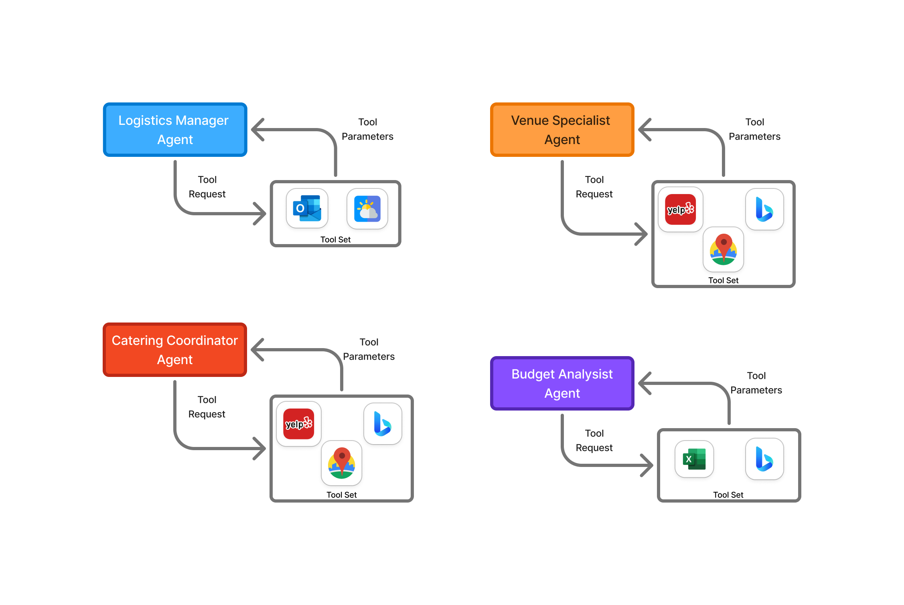

# Project Overview

This is a Python project that uses **Microsoft Agent Framework**--the new unified orchestration framework that combines the best of:

- **Semantic Kernel**: Enterprise-ready AI orchestration
- **AutoGen**: Multi-agent conversation patterns

To build a multi-agent event planning workflow.

# ExecPlans

When writing complex features or significant refactors, use an ExecPlan (as described in `specs/PLANS.md`) from design to implementation. If the user request requires multiple specs, create multiple specification files in the `specs/` directory. After creating the specs, create a master ExecPlan that links to each individual spec ExecPlan. Update the `specs/README.md` to include links to the new specs.

ALWAYS start an ExecPlan creation by consulting the DeepWiki tool for best practices on design patterns, architecture, and implementation strategies. Ask it questions about the system design and constructs in the library that will help you achieve your goals.

Skip using an ExecPlan for straightforward tasks (roughly the easiest 25%).

# Architecture

This project follows a multi-agent workflow architecture.

Here is a description of each of the agents in the workflow:

- **Event Coordinator**: Orchestrates the overall planning process
- **Venue Specialist**: Researches and recommends venues
- **Budget Analyst**: Manages costs and financial constraints
- **Catering Coordinator**: Handles food and beverage planning
- **Logistics Manager**: Coordinates schedules and resources

## Workflow Architecture



Each agent also has access to specific tools to assist in their tasks. The diagram below illustrates the agents and their associated tools:

## Agents and Tools



- Bing Search with Grounding
- Weather Tool
- Calendar Tool (ICal)
- Code Interpreter (Python REPL)
  - Includes scratchpad creation for complex calculations and data analysis
- Tool Orchestration MCP (sequential-thinking-tools)

## Directory Structure

IMPORTANT: For your agents to be discovered by the DevUI, they must be organized in a directory structure like below. Each agent/workflow must have an `__init__.py` that exports the required variable (`agent` or `workflow`).

**Note**: `.env` is a shared env file, it contains the Azure OpenAI config, if this doesn't exist refer to `.env.example` and ask user for values and create `.env`

```
spec-to-agents/
├── src/
│   └── spec_to_agents/
│       ├── __init__.py
│       ├── clients.py # contains shared client code for AI Foundry
│       ├── agents/ # contains core agent/workflow definitions
│       │   ├── __init__.py
│       │   ├── budget_analyst.py
│       │   ├── catering_coordinator.py
│       │   ├── event_coordinator.py
│       │   ├── logistics_manager.py
│       │   └── venue_specialist.py
│       ├── prompts/ # contains system prompts for each agent
│       │   ├── __init__.py
│       │   ├── budget_analyst.py
│       │   ├── catering_coordinator.py
│       │   ├── event_coordinator.py
│       │   ├── logistics_manager.py
│       │   └── venue_specialist.py
│       └── tools/ # contains reusable tool definitions for agents
│           └── __init__.py
├── tests/ # contains units tests for agents and tools
├── .env  
└── pyproject.toml
```

# Development Guidelines

## General

- Before implementing a large refactor or new feature explain your plan and get approval.
- Human-in-the-loop: If you're unsure about a design decision or implementation detail, ask for clarification before proceeding. Feel free to ask clarifying questions as you are working.
- Avoid re-inventing the wheel: Use existing libraries and tools where appropriate.

## Python

`uv` is the command-line tool used to manage the development environment and dependencies in Python projects. This project uses the workspace feature of `uv` to manage multiple packages within the `packages` directory. Below are the common commands you'll use:

- `uv sync --dev` - Install / sync regular + dev dependencies
- `uv add <package>` - Add a dependency
- `uv lock` - Lock dependencies / regenerate lockfile
- `uv run` - You NEVER need to activate a virtual environment manually; just prefix commands with `uv run`
  - `uv run <script>.py` - Run a Python script
  - `uv run -m <module>` - Run a Python module
- `uv run pytest` - Run tests
- `uv run ruff .` - Run linting / formatting
- `uv run mypy .` - Run type checking

**Project-specific Commands:**
- `uv run app` - Start the Agent Framework DevUI for testing and debugging agents/workflows

### Technology Stack Focus
- **Python 3.11+**: Latest stable version with modern features
- **Pydantic**: Data validation and settings management
- **Agent Framework**: Building and orchestrating agents
- **Agent Framework DevUI**: Workflow/agent frontend
- **Infrastructure**: AI Foundry, Azure Container Apps, AZD template, Managed Identity (No API Key Authentication)

### Code Organization and Modularity

**Prefer highly modular code** that separates concerns into distinct modules. This improves:
- **Testability**: Each module can be tested in isolation
- **Reusability**: Modules can be used independently
- **Maintainability**: Changes are localized to specific modules
- **Readability**: Clear separation of concerns makes code easier to understand

**Guidelines**:
- Keep modules focused on a single responsibility
- Use clear module boundaries and minimal public APIs
- Prefer composition over large monolithic modules
- Extract shared functionality into dedicated modules as the codebase grows

### Code Organization and Modularity

**Prefer highly modular code** that separates concerns into distinct modules. This improves:
- **Testability**: Each module can be tested in isolation
- **Reusability**: Modules can be used independently
- **Maintainability**: Changes are localized to specific modules
- **Readability**: Clear separation of concerns makes code easier to understand

**Guidelines**:
- Keep modules focused on a single responsibility
- Use clear module boundaries and minimal public APIs
- Prefer composition over large monolithic modules
- Extract shared functionality into dedicated modules as the codebase grows

# Code Style

## Documentation

**IMPORTANT: Documentation means docstrings and type hints in the code, NOT separate documentation files.**

- You should NOT create any separate documentation pages (README files, markdown docs, etc.)
- The code itself should contain proficient documentation in the form of docstrings and type hints (for Python)
- For Python: Add comprehensive numpy-style docstrings to all functions, classes, and modules

**Avoid Over-Documenting:**
- Do NOT document obvious behavior (e.g., a function named `get_name` that returns a name doesn't need extensive documentation)
- Focus documentation on WHY and HOW, not WHAT (the code itself shows what it does)
- Document edge cases, non-obvious behavior, and important constraints
- Skip docstrings for trivial functions where the name and type hints are self-explanatory
- Prioritize documenting public APIs, complex logic, and non-intuitive design decisions

## Python

### Documentation and Comments

- Write clear and concise comments for each function.
- Ensure functions have descriptive names and include type hints.
- Provide docstrings following PEP 257 conventions.
  - Use `numpy` style for docstrings. Example:

  ```python
  def calculate_area(radius: float) -> float:
      """
      Calculate the area of a circle given the radius.

      Parameters
      ----------
      radius : float
          The radius of the circle.

      Returns
      -------
      float
          The area of the circle, calculated as π * radius^2.
      """
      import math
      return math.pi * radius ** 2
  ```
- Use proper built-in type annotations (e.g. `dict[..., ...]`, `list[...]`, `tuple[...]`) and only using `typing` module when needed.
- Prefer to use `|` for union types instead of `Union[...]`, `type | None` instead of `Optional[...]`, etc.
- Break down complex functions into smaller, more manageable functions.

# Test-Driven Development (TDD)

- Never create throwaway test scripts or ad hoc verification files
- If you need to test functionality, write a proper test in the test suite

## Python

- Write tests for all new features in the `tests/` directory
- Use `pytest` as the testing framework
- Use `pytest-mock` for mocking dependencies
- Aim for high test coverage, especially for critical components
- Always include test cases for critical paths of the application.
- Account for common edge cases like empty inputs, invalid data types, and large datasets.
- Include comments for edge cases and the expected behavior in those cases.
- Write unit tests for functions and document them with docstrings explaining the test cases.

# Tools

You have a collection of tools available to assist with development and debugging. These tools can be invoked as needed.

- `sequential-thinking-tools`
  - **When to use:** For complex reasoning tasks that require step-by-step analysis. A good rule of thumb is if the task requires more than 25% effort.
- `deepwiki`
  - **When to use:** Consult for external knowledge or documentation that is not part of the immediate codebase. Can be helpful for system design questions or understanding third-party libraries.
- `context7`
  - **When to use:** For retrieving immediate documentation on the latest version of a library or framework. Useful for quick lookups to double-check syntax, parameters, or usage examples.
- `playwright`
  - **When to use:** Interact with DevUI for testing the workflow end-to-end from prompt to final result. Prefer using this as your default snapshot testing tool. You also have the ability to use `playwright` for viewing the browser console logs and network requests to help debug issues that may arise.

# Updates to This Document
- Update this document as needed to reflect changes in development practices or project structure
  - Updates usually come in the form of the package structure changing
- Do NOT contradict existing guidelines in the document
- This document should be an executive summary of the development practices for this project
  - Keep low-level implementation details out of this document