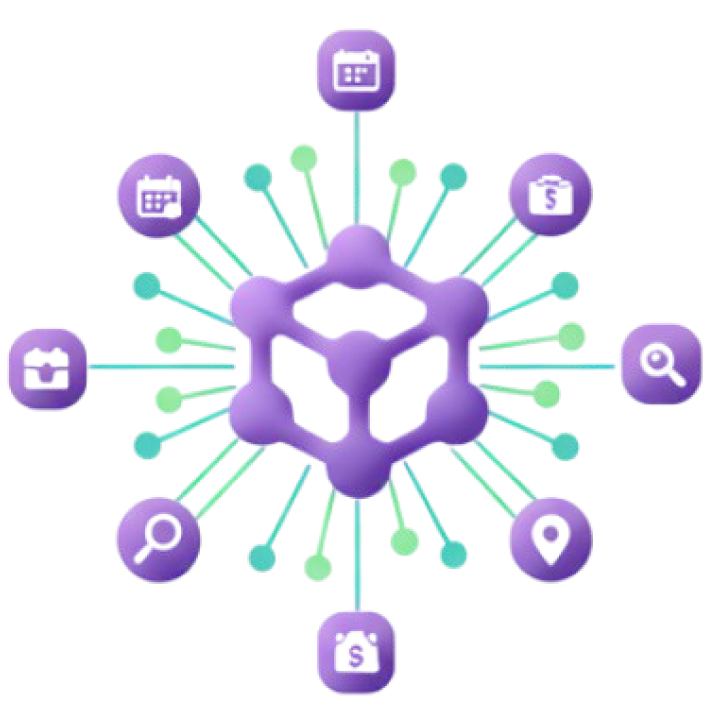

<p align="center">
  
</p>

# Event Planning Multi-Agent System

A multi-agent event planning workflow built with **[Microsoft Agent Framework](https://github.com/microsoft/agent-framework)** - combining Semantic Kernel's enterprise orchestration with AutoGen's multi-agent patterns.

> [!NOTE]
> **Ignite 2025 Lab**: [LAB513 - Build A2A and MCP Systems Using SWE Agents and Agent Framework](https://github.com/microsoft/ignite25-LAB513-build-a2a-and-mcp-systems-using-swe-agents-and-agent-framework/blob/main/lab/instructions/instructions.md)

## 🎯 What This Demonstrates

This sample shows you how to build a production-ready multi-agent system with:

- **Multi-Agent Orchestration**: 5 specialized agents coordinating event planning
- **Human-in-the-Loop**: Interactive approval and feedback during workflow execution
- **Tool Integration**: Web search, weather APIs, calendar management, and code interpreter
- **Azure Deployment**: One-click deployment with Azure Developer CLI (azd)

## 🏗️ Architecture

### Multi-Agent Workflow Design

The system uses a **coordinator-centric star topology** where the Event Coordinator routes tasks to specialized agents and synthesizes their outputs into a comprehensive event plan:


### Agent Tools & Capabilities

Each specialist agent has access to domain-specific tools for their area of expertise:


**Tool Integration:**
- **Venue Specialist**: Web Search (Bing Grounding)
- **Budget Analyst**: Code Interpreter (Python REPL)
- **Catering Coordinator**: Web Search (Bing Grounding)
- **Logistics Manager**: Weather API (Open-Meteo) + Calendar Tools (iCalendar)

## 🚀 Quick Start

### Prerequisites

- Python 3.11+
- [uv](https://docs.astral.sh/uv/) - Python package manager
- [Azure CLI (az)](https://learn.microsoft.com/cli/azure/install-azure-cli)
- [Azure Developer CLI (azd)](https://learn.microsoft.com/azure/developer/azure-developer-cli/install-azd)
- Azure subscription

### Deploy to Azure

```bash
# Clone and navigate to the repository
git clone https://github.com/microsoft/spec-to-agents.git
cd spec-to-agents

# Login to Azure
az login
azd auth login

# Deploy everything (provisions resources, generates .env, installs dependencies)
azd up
```

**What happens:**
- ✅ Provisions Azure AI Foundry + OpenAI models
- ✅ Generates `.env` with connection details
- ✅ Installs Python dependencies via `uv sync`

### Run Locally

**Interactive Console (Recommended):**
```bash
uv run console
```

**DevUI (Visual Interface):**
```bash
uv run app
```

Then navigate to the URL shown (typically `http://localhost:8000`)

### Example Input

Try this event planning request:

```
Plan a corporate holiday party for 50 people on December 6th, 2025 in Seattle 
with a budget of $5,000. Include venue options, catering for dietary restrictions, 
and check the weather forecast.
```

The agents will collaborate to:
1. Search for suitable venues
2. Calculate budget breakdown
3. Recommend catering options
4. Check weather and create calendar event
5. Synthesize a comprehensive plan


## 🛠️ Project Structure

```
spec-to-agents/
├── src/spec_to_agents/
│   ├── agents/          # Agent definitions (budget_analyst, venue_specialist, etc.)
│   ├── prompts/         # System prompts for each agent
│   ├── tools/           # Tool implementations (web search, weather, calendar)
│   ├── workflow/        # Workflow orchestration logic
│   └── utils/           # Shared utilities and clients
├── tests/               # Unit and integration tests
├── infra/               # Azure infrastructure (Bicep templates)
└── scripts/             # Post-provisioning hooks
```

## 🔑 Key Features

### Service-Managed Threads
All agents use `store=True` for automatic conversation history management via Azure AI Service - no manual message tracking required.

### Human-in-the-Loop
Framework-native `ctx.request_info()` enables pausing workflows for user input with automatic state preservation.

### Structured Output Routing
Agents return Pydantic models with explicit routing decisions (`next_agent` field), enabling dynamic workflow orchestration.

### Tool Integration
- **Web Search**: Bing Search with Grounding for venue and catering research
- **Code Interpreter**: Python REPL for budget calculations
- **Weather API**: Open-Meteo for weather forecasts
- **Calendar Tools**: iCalendar (.ics) management

## 🧪 Development

**Run Tests:**
```bash
uv run pytest
```

**Detailed Setup:**
See [DEV_SETUP.md](./DEV_SETUP.md) for debugging instructions and manual configuration.

## 📦 Azure Resources

Provisioned automatically by `azd up`:

- **Azure AI Foundry**: Hub and Project for agent orchestration
- **Azure OpenAI**: GPT-4o-mini (primary) and GPT-4.1-mini (web search)
- **Bing Search**: Grounding API for web searches
- **Container Registry & App**: For deployment (optional)
- **Application Insights**: Telemetry and monitoring

# 🤝 Contributing

This project welcomes contributions and suggestions. Most contributions require you to agree to a Contributor License Agreement (CLA).

# 📄 License

This project is licensed under the MIT License - see the [LICENSE](LICENSE) file for details.

